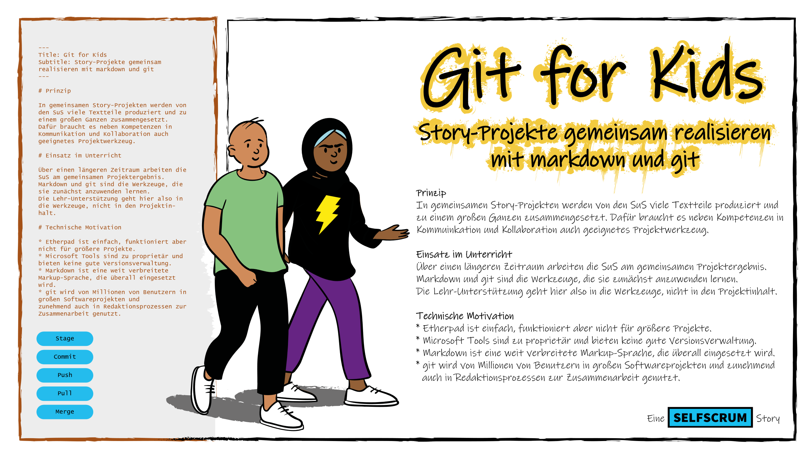
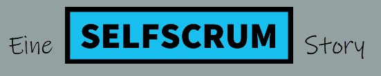

+++
title = "Learn to Learn to Learn Git"
outputs = ["Reveal"]
+++



<h3 style="color: #000;">Learn to Learn to Learn git</h3>

---



## Warum?

* Immer mehr Content in immer kürzerer Zeit
* Verschiedenste Medien
* Grassroot Publishing

---



## Die Lösung?

* Schlankes Editierformat -> **Markdown**
* Co-Authoring und Release Management -> **git**
* Automatisiertes Publishing -> **hugo, github, pandoc**

---



## Vorhaben

<ul>
<li style ="color: #000;"> "Learn enough git to be dangerous" (Michael Hartl)</li>
<li style ="color: #000;"> Sich erarbeiten, wie man git-Konzepte versteht und erklären kann</li>
<li style ="color: #000;"> Einen Guide darüber schreiben</li>
</ul>

---



<h2 style="color: #fff;">Format</h2>

<a href = "https://cogneon.github.io/lernos/" target="_blank" style="color:#fff;">#lernOS Circle</a>

<ul>
<li style ="color: #fff;"> W1-4: git und Markdown in einem eigenen Beispiel</li>
<li style ="color: #fff;"> W5-8: git Konzepte, Tools und Lern-Setting</li>
<li style ="color: #fff;"> W9-12: lernOS Guide schreiben</li>
</ul>

...oder?

---



<h2 style="color: #fff;">Starten</h2>

<ul>
<li style ="color: #fff;"> Beginn: KW 39 - Kickoff Zoom</li>
<li style ="color: #fff;"> Dauer: Bis Jahresende</li>
<li style ="color: #fff;"> Kosten: 0 EUR</li>
<li style ="color: #fff;"> Format: Online Meetings, einmal wöchentlich</li>
<li style ="color: #fff;"> Projekt Chat in telegram, slack o.ä.</li>
<li style ="color: #fff;"> bitte anmelden bei <a href="mailto:git-for-kids@selfscrum.org" style="color: #056478;">git-for-kids@selfscrum.org</a></li>
</ul>

